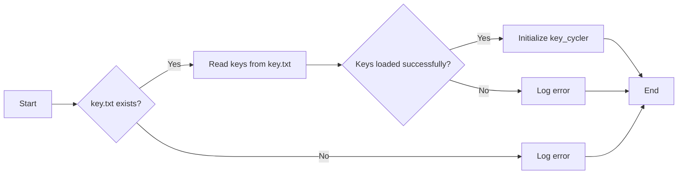
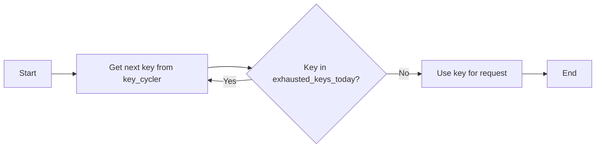
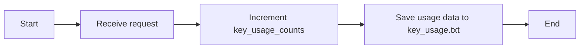
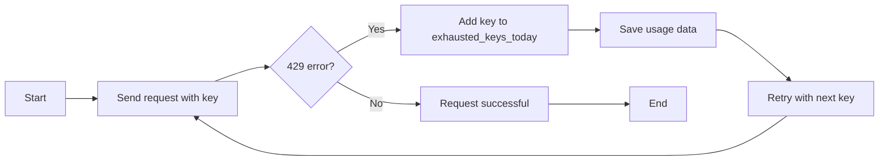
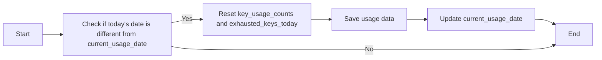
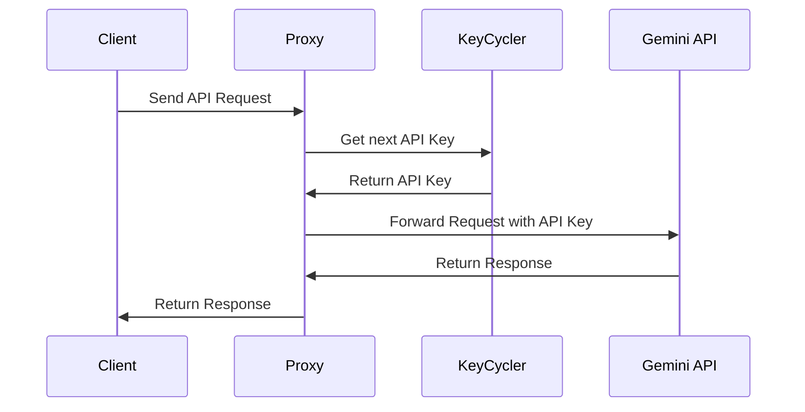

# Gemini Key Manager Documentation

## I. Introduction

The Gemini Key Manager is a Python Flask proxy server designed to manage multiple Google Gemini API keys effectively. It allows clients to interact with the Gemini API using a single placeholder token, while the proxy handles key rotation, daily usage tracking, and rate limit management behind the scenes.

This documentation provides a detailed overview of the Gemini Key Manager, including its core features, architecture, configuration, usage, and deployment. It is intended for developers, system administrators, and anyone interested in using the Gemini Key Manager to manage their Gemini API keys.

## II. Core Features

*   **API Key Rotation:** The proxy server cycles through a list of provided Gemini API keys (`key.txt`) for each incoming request, distributing the load and ensuring that no single key is overused.
*   **Placeholder Token:** Clients use a predefined placeholder token (`PLACEHOLDER_GEMINI_TOKEN`) for authentication against the proxy, keeping the real keys secure on the server.
*   **Daily Usage Tracking:** The proxy server monitors and logs the number of times each API key is used per day, providing valuable insights into key usage patterns.
*   **Persistent Usage Data:** Daily usage counts and the list of exhausted keys are saved to a local file (`key_usage.txt`) in JSON format, allowing state to be preserved across server restarts.
*   **Automatic Rate Limit (429) Handling:** The proxy server detects when a key receives a 429 "Resource Exhausted" error from the Gemini API, marks the exhausted key as unusable for the rest of the current day, and automatically retries the request with the next available key in the pool. If all keys become exhausted for the day, the proxy server returns a 503 "Service Unavailable" error.
*   **Daily Reset:** The proxy server automatically resets usage counts and the list of exhausted keys at the beginning of each new day, ensuring that all keys are available for use.
*   **OpenAI API Compatibility:** The proxy server acts as an adapter for the `/v1/chat/completions` endpoint, accepting requests in OpenAI format (including streaming) and translating them to/from the Gemini API format. This allows clients that are designed to work with the OpenAI API to seamlessly integrate with the Gemini API.
*   **Configurable Logging:** The proxy server provides detailed logging to both console and rotating log files (written to the current working directory by default) for debugging and monitoring.

## III. API Key Rotation and Usage Tracking Logic

This section provides a detailed explanation of the API key rotation and usage tracking logic, including Mermaid flowcharts and a sequence diagram to illustrate the process.

### A. API Key Loading

The `load_api_keys` function is responsible for loading the API keys from the `key.txt` file. This function reads the file, extracts the API keys (one per line), and stores them in a global list called `all_api_keys`. The function also handles potential errors, such as the file not being found or being empty.



### B. API Key Cycling

The `key_cycler` variable is a `cycle` iterator that is initialized with the `all_api_keys` list. This iterator allows the proxy server to cycle through the API keys in a round-robin fashion. The `next(key_cycler)` function is used to get the next API key from the iterator.



### C. Usage Tracking

The `key_usage_counts` dictionary is used to track the number of times each API key has been used per day. The `load_usage_data` function is responsible for loading the usage data from the `key_usage.txt` file. The `save_usage_data` function is responsible for saving the usage data to the `key_usage.txt` file.



### D. Usage Tracking Granularity

The Gemini Key Manager tracks API usage on a **per-API key basis**. The `key_usage_counts` dictionary stores the number of requests made using each individual API key.

It is important to note that the proxy **does not** track API usage based on the specific Gemini model being used for a request (e.g., `gemini-pro`, `gemini-ultra`). Usage statistics are aggregated solely by the API key that processed the request.

### E. Rate Limit Handling

The proxy server detects 429 "Resource Exhausted" errors from the Gemini API. When a 429 error is detected, the corresponding API key is added to the `exhausted_keys_today` set. The proxy server will not use any API keys in the `exhausted_keys_today` set until the next day.



### E. Daily Reset

The proxy server automatically resets the usage counts and the list of exhausted keys at the beginning of each new day. This is done by checking if the current date is different from the date stored in the `current_usage_date` variable. If the dates are different, the `key_usage_counts` dictionary and the `exhausted_keys_today` set are reset.



### F. Sequence Diagram

This sequence diagram illustrates the interaction between the different components involved in API key rotation and usage tracking.



## IV. Configuration

The Gemini Key Manager can be configured using the following variables in the `gemini_key_manager.py` file:

*   `PLACEHOLDER_TOKEN`: The placeholder token that clients will use to authenticate against the proxy.
*   `API_KEY_FILE`: The path to the file containing the Gemini API keys.
*   `GEMINI_API_BASE_URL`: The base URL for the Gemini API.
*   `LISTEN_HOST`: The host that the proxy server will listen on.
*   `LISTEN_PORT`: The port that the proxy server will listen on.
*   `LOG_DIRECTORY`: The directory where the log files will be stored.
*   `LOG_LEVEL`: The logging level.

## V. Usage

To use the Gemini Key Manager, you need to configure your client to send requests to the proxy server instead of directly to the Gemini API. You also need to set the `x-goog-api-key` header to the `PLACEHOLDER_TOKEN`.

For example, if you are using the `curl` command, you can send a request to the proxy server like this:

```bash
curl -H "x-goog-api-key: PLACEHOLDER_GEMINI_TOKEN" http://localhost:5000/v1beta/models/gemini-pro:generateContent -d '{"contents": [{"parts": [{"text": "Write a story about a magic backpack."}]}]}'
```

## VI. Deployment

The Gemini Key Manager can be deployed using Docker. To build the Docker image, run the following command:

```bash
docker build -t gemini-key-manager .
```

To run the Docker container, run the following command:

```bash
docker run -d -p 5000:5000 -v "<your_local_key_file_path>:/app/key.txt" -v "<your_local_usage_data_file_path>:/app/key_usage.txt" --name gemini-proxy gemini-key-manager
```

## VII. Troubleshooting

If you encounter any issues with the Gemini Key Manager, please check the log files for errors. Some common issues include:

*   **Rate Limit Errors:** If you are receiving 429 "Resource Exhausted" errors, it means that you have exceeded the rate limit for your Gemini API keys. You can try adding more API keys to the `key.txt` file or reducing the number of requests that you are sending.
*   **Configuration Issues:** If the proxy server is not working correctly, please check the configuration variables in the `gemini_key_manager.py` file to make sure that they are set correctly.
*   **Deployment Problems:** If you are having trouble deploying the proxy server using Docker, please check the Docker logs for errors.